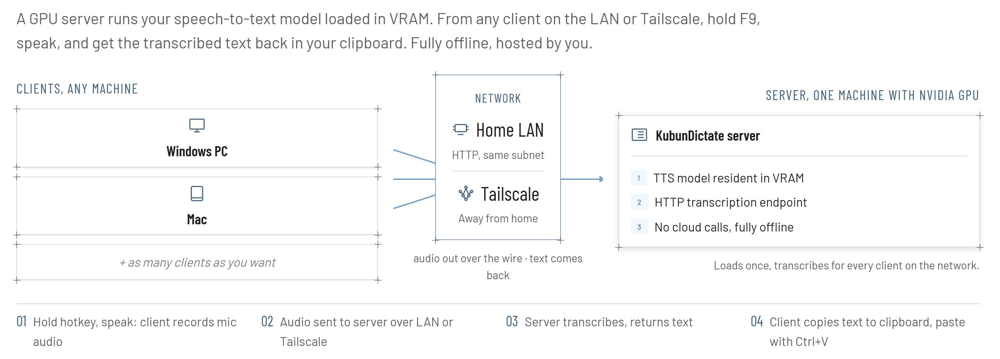

# KubunDictate



**TL;DR:** Hold a key, talk, let go, and your words land on your
clipboard, ready to paste anywhere. It runs entirely on your own hardware: no
cloud, no accounts, nothing leaves your network. One computer with a
graphics card does the actual transcribing; any other Windows PC or
Mac on the same network can use it. Windows and Mac are both done and
working today.

## What you need

- **One PC with an NVIDIA graphics card.** This is the "server": it
  does the transcribing. Set it up once.
- **Any number of other computers** (Windows or Mac) to actually talk
  into day to day: these are "clients." No graphics card needed. You
  can also use the server PC itself as a client.

## Set up the server (the PC with the graphics card)

Open PowerShell as Administrator, then from this folder:

```
server\install.ps1
```

It asks a few quick questions (port, which speech model, an optional
shared password) and sets everything up. Then start it:

```
server\start.bat
```

The first run downloads the speech model (a few GB). That only
happens once. Leave this running; it's what your clients talk to.

Want it to start on its own every time this PC turns on? See
[Start the server automatically](#start-the-server-automatically) below.

## Set up a client (any other computer)

**Windows:**

```
client\windows\install.ps1
client\windows\start_tray.bat
```

**Mac:**

```
./client/mac/install.sh
./client/mac/start_tray.sh
```

The installer asks where the server is: the IP address of the server PC
on your network (or `localhost:9505` if this is the same computer as the
server). It also offers to save a second address for
[using it away from home](#using-it-away-from-home), so you can switch
between the two later without setting anything up again.

On a Mac, the first launch also asks for two permissions
(**Accessibility** and **Input Monitoring**, under System Settings →
Privacy & Security). Click Allow for both, then quit and reopen the
app once, since permissions only take effect after a restart. If your Mac
is set to German, these are labeled *Bedienungshilfen* and
*Eingabeüberwachung*.

## Using it

- Hold **F9** (Windows) or **Left Option** (Mac) to record, let go to
  transcribe. Left Option is used on Mac because F-keys default to
  media controls there.
- The text lands on your clipboard automatically. Paste it anywhere
  with Ctrl+V (Cmd+V on Mac).
- A small popup near the top of your screen and a short sound confirm
  what's happening: listening, working, done.
- Right-click the tray icon (Windows) or click the menu-bar icon (Mac)
  to switch between your saved servers (say, home and Tailscale), edit
  the list, or turn on "run automatically at startup."

## Start the server automatically

To have the server come up on its own at boot, even before anyone logs
in, from an **Administrator** PowerShell:

```
server\install_service.ps1
```

Check whether it's running any time with:

```
server\status.ps1
```

Turn it off again with `server\uninstall_service.ps1`.

If you ever move the project folder somewhere else, re-run
`server\install_service.ps1` afterwards: the startup entry remembers the
old location, so the server would otherwise quietly fail to come up at
boot.

## Starting fresh

If something's acting up and you want a clean slate for a client:

```
client\windows\uninstall.ps1   REM Windows
./client/mac/uninstall.sh      # Mac
```

This removes everything the installer set up (but never anything the
server needs, even if you run both roles on the same machine). Run
the install command again afterward for a genuine fresh start.

## Using it away from home

Works on your home network automatically. To reach it from elsewhere
(say, a laptop out and about), install [Tailscale](https://tailscale.com/)
on both the server and client, and give the client the server's Tailscale
address as a second server when it asks. Then just pick whichever one you
need from the tray menu. Nothing has to be opened up to the internet.

## Settings

- **Server:** edit `server\config.bat`: port, which speech model to use,
  and an optional shared password if you want to restrict who can use it
  (off by default; fine to leave off on a trusted home network).
- **Client:** your saved servers live in a small file the installer
  writes. Pick **Edit servers...** from the tray menu to open it, then
  **Reload servers** once you've saved. Each entry is just a name and an
  address:

  ```json
  {
    "servers": [
      { "name": "Home",      "url": "192.168.1.50:9505", "token": null },
      { "name": "Tailscale", "url": "100.64.0.1:9505",   "token": null }
    ],
    "active": "Home"
  }
  ```

  `token` is only needed if you set a shared password on the server.

## If something's not working

The client writes a log you can check:

- **Windows:** `%APPDATA%\KubunDictate\client.log`
- **Mac:** `~/Library/Application Support/KubunDictate/client.log`

It records which microphone was opened, which server is in use, and
anything that failed. Both clients run without a console window, so this
file is the place to look when the icon is there but nothing happens.

## Why not just use an existing tool?

The starting point was [whisper-writer](https://github.com/savbell/whisper-writer),
which already does hotkey-record-transcribe and also auto-types the
result into whatever app is focused. Once it was clear that "put it on
the clipboard, paste it yourself" was actually enough, whisper-writer's
extra machinery for auto-typing stopped earning its keep, so this
project is a smaller, purpose-built alternative instead.

## A note on the server's graphics card

The default speech model comfortably fits on a 16GB graphics card with
room to spare. If you're also running something else that uses a lot
of graphics memory, switch to a smaller/faster model via
`KUBUNDICTATE_MODEL` in `server\config.bat` (`distil-large-v3` or
`medium` use noticeably less).

## Project files

Files are grouped by role: `server/` is everything the GPU box needs,
`client/` is everything a machine you dictate from needs. You only ever
touch one of them per machine (or both, if one PC does both jobs).

```
server/          the transcribing end -- Windows only
client/          the dictating end
  windows/       Windows-specific setup + launcher
  mac/           Mac-specific setup + launcher
docs/            diagrams used by this README
```

**`server/`**

| File | What it's for |
|---|---|
| `server.py` | The server program |
| `audio.py` | Decodes incoming audio (the server half of the format) |
| `install.ps1` | One-time setup |
| `start.bat` | Everyday launcher |
| `start_hidden.bat` | Silent launcher used by the boot-time startup entry |
| `install_service.ps1` / `uninstall_service.ps1` | Start the server automatically at boot |
| `status.ps1` | One-command check: is the server up? |
| `config.bat.example` | Template for the server's settings |
| `requirements.txt` | The pip packages the server needs |

**`client/`**

| File | What it's for |
|---|---|
| `client.py` | Shared recording/transcribing logic used by both clients |
| `audio.py` | Encodes recorded audio (the client half of the format) |
| `tray_client.py` / `win_toast.py` | Windows tray client and its on-screen popup |
| `tray_client_mac.py` / `mac_toast.py` | Mac menu-bar client and its popup |
| `icons/` | Tray and popup artwork |
| `windows/install.ps1` / `windows/uninstall.ps1` | One-time setup / removal |
| `windows/start_tray.bat` | Everyday launcher |
| `mac/install.sh` / `mac/uninstall.sh` | Same, for Mac |
| `mac/start_tray.sh` | Everyday launcher |
| `windows/requirements.txt` / `mac/requirements.txt` | The pip packages each client needs |

One thing lives outside this split: the `venv/` folder at the top level,
created by whichever installer you run first. Both roles share it, so a
PC doing both jobs only needs one copy of the dependencies.
