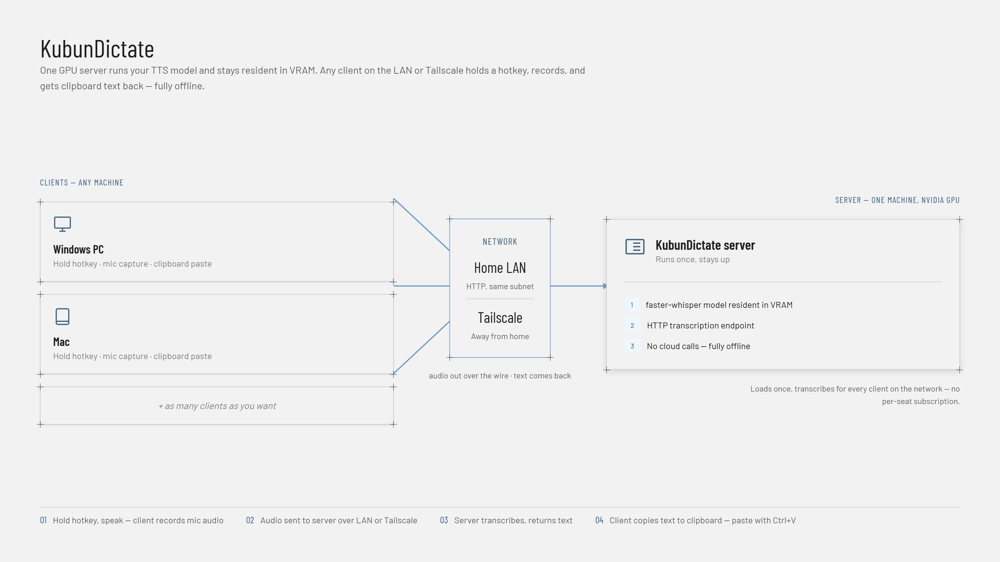

# KubunDictate



Local, offline push-to-talk dictation: hold a hotkey, talk, release it,
and the transcription is copied to your clipboard so you can paste
(Ctrl+V) it wherever you want. Runs entirely offline (no cloud API calls)
via [faster-whisper](https://github.com/SYSTRAN/faster-whisper).

Two independent roles, each with its own installer:

- **server** -- runs once, on a machine with an NVIDIA GPU. Loads the
  Whisper model and keeps it resident in VRAM, exposing a transcription
  endpoint over HTTP.
- **client** -- runs on any Windows PC or Mac on your LAN (including the
  server box itself, if you also want to dictate there), as a
  tray/menu-bar icon. Handles the hotkey, records your mic, sends the
  audio to the server, and copies the returned text to your clipboard.
  No GPU or model download required.

## Status

- **Windows client/server**: working. Server on the GPU box, thin
  clients on any Windows PC on the LAN.
- **Runs unattended at boot**: working, via a Windows Scheduled Task
  (see "Run as a service" below) -- verified surviving a reboot with no
  one logged in.
- **Mac client**: available, not yet verified on real hardware -- see
  "Client (macOS)" below and
  [issue #24](https://github.com/andresest83/kubundictate/issues/24).
- **Android client**: planned, not started.

## Setup

### Quick install

After `git clone`, run the installer for whichever role this machine
plays:

```
install_server.ps1   REM the GPU box -- needs an elevated (Administrator) PowerShell
install_client.ps1   REM any other Windows PC -- no elevation needed
```

`install_server.ps1` creates the venv, installs the server
dependencies, writes `config.bat`, provisions the Windows Firewall
rule, and can register the startup service. `install_client.ps1`
creates the venv and installs the tray app's dependencies --
`start_tray.bat` asks for the server's address itself the first time
it runs, no `config.bat` needed.

On a Mac, use `install_client_mac.sh` instead -- see "Client (macOS)"
below. The server is Windows-only (needs the NVIDIA GPU box).

Want to dictate directly on the GPU box too? Run `install_client.ps1`
there as well, same as any other machine -- point it at
`localhost:<port>` when it asks for a server address.

Re-running either is safe -- both skip venv creation if one already
exists, and `install_server.ps1` asks before overwriting an existing
`config.bat`.

### Manual setup

```
python -m venv venv
venv\Scripts\pip install -r requirements-server.txt   REM on the GPU box
venv\Scripts\pip install -r requirements-client.txt   REM on any other Windows PC
```

```
python3 -m venv venv
venv/bin/pip install -r requirements-client-mac.txt   # on a Mac
```

For the server, copy `config.bat.example` to `config.bat` and fill in
the values (see [Configuration](#configuration) below) -- `config.bat`
is gitignored, so each machine keeps its own local settings. Neither
client uses `config.bat`; skip straight to running `start_tray.bat`
(Windows) or `start_tray_mac.sh` (macOS), described below.

### Server (the GPU box)

Run `start_server.bat`. First run downloads the model (~1.6GB for
`large-v3-turbo`) to the Hugging Face cache. Leave it running -- it's a
resident process serving requests on `KUBUNDICTATE_PORT` (default 50505).

### Client (any Windows PC, including the GPU box itself)

Run `start_tray.bat` (no console window -- just an icon in the system
tray). First run asks for the server's address (LAN IP or Tailscale IP,
or `localhost:<port>` if this is the server's own box) and, if the
server has one, its shared token. Settings are saved to
`%APPDATA%\KubunDictate\client_settings.json`, which remembers the
last 3 servers you've used -- right-click the tray icon to switch
between them or enter a new one.

- Hold **F9** to record, release to transcribe. The text lands on the
  clipboard automatically -- paste it with Ctrl+V anywhere.
- The tray icon changes color while recording.
- A short beep marks start/stop of recording, a higher beep marks a
  successful transcription, and a low beep marks a failed request (e.g.
  server unreachable).
- Right-click the tray icon -> **Quit** to exit.
- Right-click -> **Run at startup** to toggle launching automatically at
  login (adds/removes a `pythonw.exe start_tray.bat`-equivalent entry
  under the current user's Registry Run key). Off by default -- launch
  `start_tray.bat` manually otherwise.

### Client (macOS)

Menu-bar equivalent of the Windows tray client (issue
[#24](https://github.com/andresest83/kubundictate/issues/24)), same
record/transcribe engine underneath. From this folder (Terminal, no
elevation needed):

```
./install_client_mac.sh
./start_tray_mac.sh
```

First launch asks for the server's address (LAN IP or Tailscale IP, or
`localhost:<port>` if this is the server's own box) and, if the server
has one, its shared token. Settings are saved to `~/Library/Application
Support/KubunDictate/client_settings.json`, remembering the last 3
servers you've used -- click the menu-bar icon to switch between them or
enter a new one.

- Hold **F9** to record, release to transcribe. The text lands on the
  clipboard automatically -- paste it with Cmd+V anywhere.
- The menu-bar icon changes color while recording.
- A short tone marks start/stop of recording, a higher tone marks a
  successful transcription, and a low tone marks a failed request.
- Click the menu-bar icon -> **Quit** to exit.
- Click -> **Run at login** to toggle launching automatically at login
  (adds/removes a LaunchAgent under `~/Library/LaunchAgents/`). Off by
  default -- launch `start_tray_mac.sh` manually otherwise.
- **First launch will prompt macOS for Input Monitoring and Microphone
  access** (System Settings -> Privacy & Security) -- both are required
  for the hotkey and recording to work. Grant them when asked; if you
  miss the prompt, add the terminal/python process manually under those
  two Privacy & Security panes and relaunch.

Not yet verified end-to-end on real hardware -- see the note on issue
#24.

## Run as a service (Windows startup, no login required)

To have the server come up at boot -- before any login, and stay up
across logout -- register it as a scheduled task:

```
install_server_service.ps1
```

Run from an **elevated** (Administrator) PowerShell. It registers a
Scheduled Task named `KubunDictateServer` that runs
`start_server_hidden.bat` at startup as `NT AUTHORITY\SYSTEM`, with
automatic restart on failure. Requires `install_server.ps1` to have
already been run in this folder (`config.bat` present).

- Start it immediately without rebooting: `Start-ScheduledTask -TaskName KubunDictateServer`
- Logs: same `kubundictate.log` as `start_server_hidden.bat`
- Remove it: `uninstall_server_service.ps1` (also elevated)

This uses Task Scheduler rather than a "real" Windows service (no new
dependencies, reuses the existing hidden launcher) -- close enough for a
single-user home GPU box. A `pywin32`-based service remains an option
later if `services.msc` integration is ever actually needed.

### Check status

```
status_server.ps1
```

No elevation needed -- run it from any PowerShell prompt on the server
box. Reports whether the scheduled task is running and whether the
server is actually answering requests (`/health`), in one summary
instead of two separate things to remember.

## Configuration

The tray client doesn't use `config.bat` at all -- its server
address/token are set through its own first-run prompt and tray menu,
stored in `%APPDATA%\KubunDictate\client_settings.json`. These apply
to the server only (`config.bat`, written by `install_server.ps1`):

- `KUBUNDICTATE_HOST` -- bind address. Default `0.0.0.0`.
- `KUBUNDICTATE_PORT` -- port. Default `50505`.
- `KUBUNDICTATE_MODEL` -- faster-whisper model size/name. Default
  `large-v3-turbo`. Smaller/faster options: `distil-large-v3`,
  `medium`, `small`. See
  [available models](https://github.com/SYSTRAN/faster-whisper#model-conversion).
- `KUBUNDICTATE_LANGUAGE` -- force a language code (e.g. `en`) to skip
  auto-detection and speed things up slightly. Default: auto-detect.
- `KUBUNDICTATE_TOKEN` -- shared secret. If set on the server, clients
  must send the same value or requests are rejected. Optional, **off
  by default** -- `install_server.ps1` prompts: Enter for none,
  `generate` for a strong random one, or type your own (8+ chars,
  needs a letter, a number, and one of `-_.~+`). That character set is
  deliberately narrow: `config.bat` is `call`ed by `cmd.exe`, which
  treats `%` and `^` (among others) as special and silently corrupts
  them, desyncing the server's real token from what clients were told
  -- happened once, not fun to debug, so the generator and the
  strength check both stick to characters that are inert in a batch
  file. If you do set one, it's printed prominently (and saved to
  `server-token.txt`, gitignored) so you can enter it into each
  client's tray icon (right-click -> Enter new server...). Worth
  setting if you're not sure who else is on your LAN; a trusted home
  network or Tailscale-only setup is a reasonable case to leave it off.

To change the hotkey, edit `HOTKEY` in `client.py` (uses
[pynput](https://pynput.readthedocs.io/en/latest/keyboard.html#pynput.keyboard.Key) key names).

## Remote access

Reachable on your LAN by default. For access from outside your LAN, use
[Tailscale](https://tailscale.com/) on both the server and client machines
and point the tray client at the server's Tailscale IP -- no other WAN
exposure is supported or recommended.

## Why not whisper-writer?

The initial plan was to wrap [whisper-writer](https://github.com/savbell/whisper-writer),
an existing open-source app that already does hotkey-record-transcribe and
also auto-types the result into the focused window. Once it was clear the
actual requirement was simpler -- just put the text on the clipboard and
paste it manually, not auto-type into arbitrary apps -- whisper-writer's
extra machinery (window-focus tracking, simulated keystroke injection,
its own config/UI layer) stopped earning its keep. This project is built
directly on faster-whisper + sounddevice + pynput + pyperclip + FastAPI
instead: fewer dependencies, easier to read and modify, and no behavior
beyond what's actually needed.

## Hardware notes (server)

Tuned for an RTX 5060 Ti (Blackwell, 16GB VRAM). Two Blackwell-specific
things matter here:

1. `compute_type` is hardcoded to `float16` in `server.py`. CTranslate2's
   default/int8 path crashes on RTX 50-series GPUs with
   `CUBLAS_STATUS_NOT_SUPPORTED` -- float16 is the known-good workaround.
2. `server.py` adds the `nvidia-cublas-cu12`/`nvidia-cudnn-cu12` pip
   packages' DLL directories to `PATH` at import time, since CTranslate2
   needs cuBLAS/cuDNN on Windows and doesn't bundle them itself.

`large-v3-turbo` comfortably fits in 16GB VRAM with room to spare (~2-3GB
used at rest). If you ever run the server alongside something else that's
VRAM-hungry, drop to `distil-large-v3` or `medium` via `KUBUNDICTATE_MODEL`.

## Files

- `server.py` -- FastAPI transcription server (GPU box), entrypoint
- `client.py` -- hotkey/record/clipboard engine, imported by
  `tray_client.py` (not a standalone entrypoint)
- `tray_client.py` -- Windows system-tray client entrypoint: `client.py`'s
  engine plus the tray icon/menu and the recent-servers settings file
  (see "Client")
- `tray_client_mac.py` -- macOS menu-bar client entrypoint: same
  `client.py` engine, `rumps` instead of `pystray`/winreg/tkinter (see
  "Client (macOS)")
- `audio.py` -- shared WAV<->float32 conversion helpers
- `venv/` -- self-contained Python virtual environment (not committed)
- `install_server.ps1` -- one-shot server setup: venv, dependencies,
  `config.bat`, firewall rule, and (optionally) the startup service
  (see "Quick install")
- `install_client.ps1` -- one-shot Windows client setup: venv,
  dependencies (see "Quick install")
- `install_client_mac.sh` -- one-shot macOS client setup: venv,
  dependencies (see "Client (macOS)")
- `start_tray_mac.sh` -- launches the macOS menu-bar client, detached
  from the calling terminal
- `start_server.bat` / `start_server_hidden.bat` -- server launchers
  (foreground / headless-and-logged)
- `start_tray.bat` -- launches the tray client (`pythonw.exe`, no
  console window)
- `install_server_service.ps1` / `uninstall_server_service.ps1` --
  register/remove the server as a Scheduled Task that runs at boot
  (see "Run as a service")
- `status_server.ps1` -- one-command server status check: scheduled
  task state + a live `/health` hit (see "Check status")
- `config.bat.example` -- template for the server's settings (copy to
  `config.bat`, which is gitignored)
- `requirements-server.txt` / `requirements-client.txt` /
  `requirements-client-mac.txt` -- pip dependencies for each role
